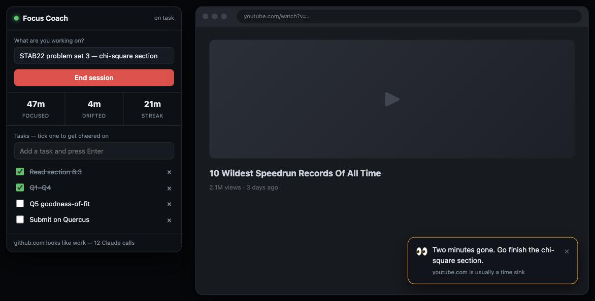

# Focus Coach

A Chrome extension (Manifest V3) that watches what you're doing in the browser, tells
you you're doing well when you're on task, and pulls you back when you're not.


*Left: the popup — goal, live stats, tasks. Right: an escalating nudge on a page that
isn't the work. Rendered from the extension's own stylesheet.*

**One-line résumé description:** Built a Chrome extension (Manifest V3) that classifies
browsing activity against a stated goal — locally by heuristics, optionally by a
Claude vision call on the live tab — and delivers escalating focus interventions.

## What it actually does

1. You tell it what you're working on ("STAB22 problem set 3") and list your tasks.
2. Every 30 seconds — and instantly whenever you switch tabs — it looks at the active
   tab and decides: **focus**, **drift**, or **neutral**.
3. On focus it stays quiet, then congratulates you at 5, 10, 20, 30, 45, 60, 90 and
   120 minute streaks, and whenever you catch yourself and come back from a drift.
4. On drift it escalates: a small toast at 45 seconds, a sharper one at 2.5 minutes,
   and a full-screen card naming your goal at 5.5 minutes (repeating every 3 minutes).
5. Tick a task off in the popup and you get confetti.

Idle time doesn't count either way — walk away from the keyboard for 90 seconds and
the clocks freeze instead of punishing your streak.

## The two modes

**Free mode (default).** Classification is a domain list plus a keyword check: sites
you marked, a built-in list of usual suspects, and whether the page title mentions
words from your goal. Watching a lecture on YouTube for a course you named in the goal
counts as focus, not drift. No network calls, no cost, works offline.

**Smart mode (optional, needs an Anthropic API key).** When the free rules are unsure —
or you're drifting, or you just landed on a new page — it sends the goal, your open
tasks, the tab title, some of the page's visible text, and optionally a screenshot of
the tab to Claude, which returns a verdict *and* writes the actual line you see. It's
what makes the messages specific ("nice, that's the third chi-square question") instead
of canned.

Cost control is built in: at most one call per minute, and only when a call could
change the answer. With screenshots on, expect roughly $0.01–0.05 per hour on Opus 5;
Sonnet 5 and Haiku 4.5 are in the model dropdown if you want it cheaper. Your key is
stored in `chrome.storage.local` on this machine only and goes nowhere but
`api.anthropic.com`.

## Important limit

A Chrome extension can only see **Chrome**. It cannot see VS Code, your terminal,
Notion's desktop app, or your phone. "Looks at your screen" here means "looks at the
active browser tab, including a real screenshot of it if you turn that on." Watching
the whole desktop would need a native app, not an extension.

## Install (unpacked — this is not on the Web Store)

1. Open `chrome://extensions`
2. Turn on **Developer mode** (top right)
3. Click **Load unpacked** and choose this folder: `~/projects/focus-coach`
4. Pin the green check icon to your toolbar
5. Click it, type your goal, hit **Start session**

After editing any file, go back to `chrome://extensions` and hit the reload arrow on
the Focus Coach card. Content-script changes also need a refresh of any open tab.

## Settings

| Setting | What it does |
| --- | --- |
| Coach tone | `hype` (loud), `calm` (quiet), `coach` (blunt) — changes the canned lines and the tone Claude writes in |
| Smart mode | Turns on the Claude calls; needs a key |
| Model | Opus 5 by default; Sonnet 5 / Haiku 4.5 are cheaper per call |
| Screenshot | Sends an image of the tab, not just its text — better judgement on visual pages, more tokens |
| Always focus / Always distraction | Your own domain lists, one per line; they beat the built-in lists |

## Debugging

- Background worker logs: `chrome://extensions` → Focus Coach → **service worker**
- Page UI logs: normal DevTools console on the page
- Smart-mode failures show up at the bottom of the popup, and never stop the coach —
  it silently falls back to the free rules.

## Layout

```
manifest.json      permissions, entry points
background.js      the brain: ticking, timing, escalation, message routing
content.js         the on-page toast/overlay/confetti, in a shadow root
popup.html/.js/.css  goal, tasks, stats, settings
lib/heuristics.js  free classification
lib/claude.js      the Anthropic API call
lib/messages.js    canned lines by tone
```
